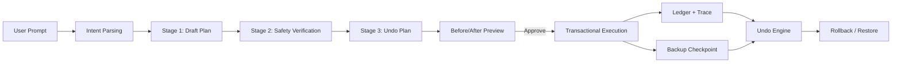

# Backtrack AI

Backtrack AI is a desktop agent that lets users organize files with natural language, preview every action before execution, and undo all applied changes with a deterministic rollback system.

## Inspiration

I was inspired by the wave of agentic tools that can take real actions on a user's machine. The promise is huge, but one thing is still missing for everyday users: trust.

From observing current products, I saw two critical gaps:

1. Preview before action: users need to see exactly what will happen before any destructive or structural changes.
2. Reliable rollback: users need a simple way to reverse changes when outcomes are not what they expected.

Backtrack AI was built to solve that trust gap. Conceptually, it is a Git-like safety layer for agentic tasks, starting with filesystem operations as a high-signal real-world use case.

## What it does

Users can type requests such as:

`Organize the backtrack-F5-test folder by creating a new Images and Pdf folder and moving all image files to Images folder and all pdf files to Pdf folder`

Backtrack then:

1. Parses intent from natural language.
2. Scans the target folder.
3. Generates a multi-stage plan.
4. Shows before/after preview in a dedicated workspace.
5. Executes changes transactionally with progress tracking.
6. Provides undo using backups + action inversion.

Core principle: nothing is executed blindly.

## How we built it

### Stack

- Electron + React + TypeScript
- Zustand for state management
- Typed IPC preload bridge
- MCP filesystem integration for controlled file operations
- Transactional services: trace store, backup service, ledger, execution engine, undo engine

### Gemini integration

Backtrack uses Gemini as the core reasoning engine in a staged planning pipeline:

1. Intent parsing: user text is parsed into structured fields such as action intent, target folder, constraints, and clarification requirements.
2. Plan generation: Gemini generates a draft action plan as structured JSON (ordered file/folder operations with dependencies).
3. Safety verification: Gemini evaluates risk and safety constraints before execution is allowed.
4. Undo-plan generation: Gemini generates rollback-oriented undo actions so the system has a reversible plan before execution.

Gemini capability mapping used in this project:

- Structured Outputs (JSON): Gemini responses are parsed into typed plan/safety/undo objects consumed by the runtime.
- Thinking for complex reasoning: multi-stage reasoning is used for safer planning (draft, then deeper safety + undo passes).
- Agentic tool workflow pattern: Gemini produces action descriptors that are executed via MCP filesystem tools only after user approval.

Without Gemini's staged reasoning + structured outputs, the app would be limited to rigid rules. With Gemini, Backtrack can handle ambiguous instructions, apply constraints, surface safety analysis, and support reversible execution with human-in-the-loop approval.

### Architecture

Backtrack uses a multi-window desktop model:

- Control panel
- Floating action button
- Chat drawer
- Dedicated preview workspace

## Challenges we ran into

1. Trust vs speed tradeoff  
   Fast agentic actions are impressive, but unsafe speed breaks trust. We solved this with staged planning and explicit approval gates.

2. Desktop orchestration complexity  
   Keeping floating button, chat drawer, preview workspace, and progress state consistent across windows required careful IPC/event design.

3. Undo correctness under real failures  
   Undo had to remain dependable even if execution was interrupted. We solved this with backup checkpoints, ledger records, and startup recovery logic.

4. Human-readable safety communication  
   Raw technical errors are unacceptable in a consumer trust product. We implemented user-friendly error translation for permissions/path failures.

## Accomplishments that we're proud of

1. End-to-end safe agentic flow from natural language prompt to previewed and approved execution.
2. Before/after visual diff workspace that makes actions understandable before files are touched.
3. Deterministic rollback model combining inverse actions with backup fallback.
4. Transactional execution with traceability (trace + ledger + progress).
5. Recovery-first design that handles interrupted runs and preserves user trust.

## What we learned

1. Agentic UX is primarily a trust problem, not just an accuracy problem.
2. Safety must be designed as a first-class product feature, not a patch after execution.
3. Preview and undo are not extras; they are adoption enablers for mainstream users.
4. Reliability infrastructure (ledger, backup, recovery) is as important as model quality.

## What's next for Backtrack AI

1. Cross-app action connectors (email, web, docs) under the same preview/undo protocol.
2. Full timeline view of state checkpoints and diffs per execution.
3. Policy engine for enterprise-safe execution constraints.
4. Cross-platform hardening and richer multimodal context ingestion.

Backtrack AI is built on a simple belief: the future of agentic software depends on user trust. Trust requires two guarantees: show me what will happen, and let me safely go back.
